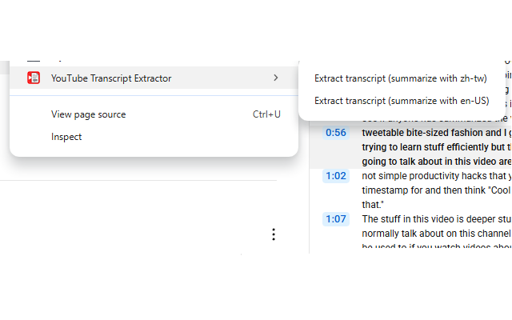

# YouTube Transcript Extractor


A Chrome extension that extracts YouTube video transcripts with timestamps via a simple right-click context menu. Uses a reliable DOM-based approach to directly interact with YouTube's native transcript feature.

## Features
- Right click to get the transcripted prompt in your clipboard
- Then paste it to Gemini or your favourite LLM

In a youtube video, right click:


Output Example:


## Installation

### From Chrome extension market
Install in [marketplace](https://chromewebstore.google.com/detail/youtube-transcript-extrac/iidfhjhiloblmopapalonhggdhaojjbl?authuser=0&hl=en-US%5C%5C%5C%5C)


### From Source

1. Clone this repository:
   ```bash
   git clone https://github.com/michaelthwan/chrome-youtube-transcript-extractor.git
   ```

2. Open Chrome and navigate to `chrome://extensions/`

3. Enable "Developer mode" (toggle in the top right)

4. Click "Load unpacked" and select the cloned folder

5. The extension will be installed and ready to use!

## Permissions

This extension requires the following permissions:

- **activeTab**: Access the current YouTube tab
- **contextMenus**: Add the right-click context menu  
- **scripting**: Execute scripts on YouTube pages for DOM manipulation


## License

This project is licensed under the MIT License - see the [LICENSE](LICENSE) file for details.
